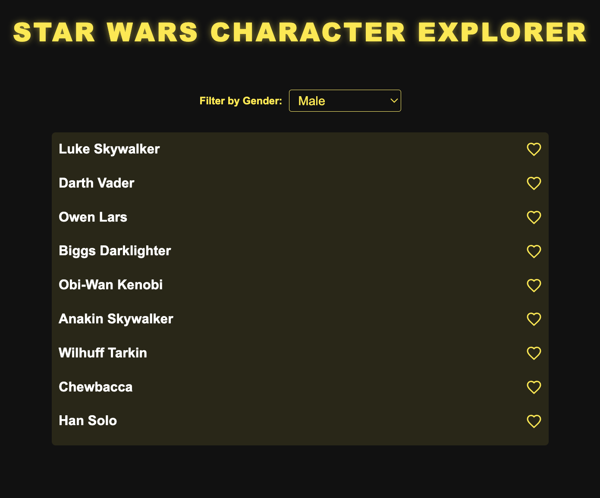

# Star Wars Character Explorer

A Star Wars character explorer built using Angular, which fetches character data from the **Star Wars API** (SWAPI). The app features an **infinite scroll** on the main page to load more characters, a **gender filter** to filter characters based on gender, and a **details page** for each character. The app is also fully tested with 100% test coverage.



## Summary of Features

- **Infinite Scroll**: The main page dynamically loads more characters as you scroll down, offering a seamless user experience.
- **Gender Filter**: A dropdown filter that allows you to view characters based on their gender.
- **Character Details Page**: Clicking on a character’s name redirects to a page with more detailed information (though the display of movies the character has appeared in is a feature to be implemented).
- **Favorites Button**: Each character has a button to mark them as a favorite (though the functionality is yet to be implemented).
- **100% Test Coverage**: All components and services are thoroughly tested with 100% test coverage to ensure the application's reliability and performance.

## Installation

### Prerequisites

- **Node.js** (version 18.x or higher)
- **npm** (Node Package Manager)

### Steps to Run the Application

1. Clone the repository:

  ```bash
   git clone https://github.com/HamzaaMB/star-thortful-wars.git
   ```

2. Install the required dependencies:

  ```bash
  npm install
   ```

3. Run the application in development mode:

  ```bash
  npm run start
   ```


This will start the development server and the application will be available at http://localhost:4200/.

## Application Architecture & Best Practices

### Components
- `CharacterListComponent:` Displays a list of characters fetched from the SWAPI with infinite scroll and gender filter.
- `CharacterDetailComponent:` Displays the detailed information for a specific character when selected.
- `ApiService:` A service responsible for handling API calls to the Star Wars API, following best practices for HTTP requests and observables.
- `Models:` TypeScript interfaces such as Character are used to type the character data, ensuring strict type checking and safer code.

### Approach Taken

- `Strict Typing with TypeScript:` The application uses TypeScript to ensure type safety throughout the project. Models like Character define the shape of the data returned by the API, which reduces runtime errors and improves code maintainability.

- `Error Handling:` The ApiService and components handle errors gracefully by catching them and displaying user-friendly messages.

- `Separation of Concerns:` The application is modularized into components (CharacterListComponent, CharacterDetailComponent), services (ApiService), and models (Character), making it easier to manage and maintain.

- `RxJS & Observables:` The app uses RxJS and observables for asynchronous data handling, ensuring a clean and responsive user experience. Observables allow us to handle data streams reactively.

- `Single Responsibility Principle:` Each component, service, and model has a single responsibility, promoting cleaner, more maintainable code.

## Testing

To run the tests and ensure 100% test coverage (please find the code coverage below):

  ```bash
  npm run test
   ```

## Code Coverage Report

The following is the **code coverage** for this project based on Jest test results:

| Metric       | % Stmts | % Branch | % Funcs | % Lines | Uncovered Line #s |
|--------------|---------|----------|---------|---------|-------------------|
| **Overall**  |   100   |   83.33  |   100   |   100   |                   |
| **Test 1**   |   100   |   100    |   100   |   100   |                   |
| **Test 2**   |   100   |   100    |   100   |   100   |                   |
| **Test 3**   |   100   |   100    |   100   |   100   |                   |
| **Test 4**   |   100   |   100    |   100   |   100   |                   |
| **Test 5**   |   100   |   100    |   100   |   100   |                   |
| **Test 6**   |   100   |   100    |   100   |   100   |                   |
| **Test 7**   |   100   |   100    |   100   |   100   |                   |
| **Test 8**   |   100   |    0     |   100   |   100   | Line 13           |
| **Test 9**   |   100   |    0     |   100   |   100   | Line 13           |

### Test Summary
- **Tests**: 17 passed, 17 total
- **Snapshots**: 0 total
- **Time**: 5.251 seconds

## To Be Implemented
- `Favorite Functionality:` Although each character has a favorite button, the functionality for saving favorites is not yet implemented. A potential solution would be to store favorite characters in localStorage or cookies. Alternatively, a backend API could be created to persist favorites across sessions.

- `Movie Information:` The CharacterDetailComponent currently displays basic character details, but the functionality to display the movies the character has appeared in (from the film property) is not implemented yet. This can be added by making an API call to fetch film details and displaying them on the character detail page.

- `Pagination Handling:` Right now, infinite scroll is used, but pagination could be added as an alternative or alongside infinite scroll for users who prefer navigating through pages.

- `Accessibility Improvements:` Improve keyboard and screen reader accessibility for users with disabilities.

## Suggested Approach for Favorites Implementation

#### 1. LocalStorage Approach:
  - When a user clicks on the favorite button, store the character's name and ID in the browser's `localStorage` or `sessionStorage`.
  - On app reload, retrieve the favorite characters from `localStorage` and highlight them or display them in a special section.

#### 2. Cookie Approach:
  - You could also store the favorites in a cookie for a more persistent experience across different browser sessions.